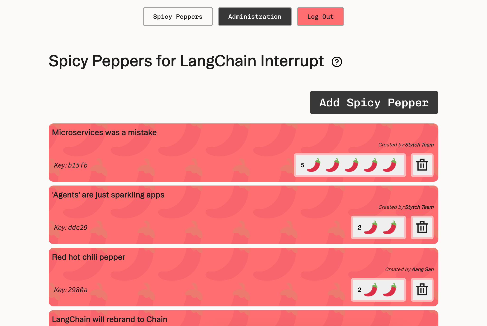

# Workers + Stytch 🌶️ Spicy Peppers 🌶️

This is a Workers server that composes three functions:
* A static website built using React and Vite on top of [Worker Assets](https://developers.cloudflare.com/workers/static-assets/)
* A REST API built using Hono on top of [Workers KV](https://developers.cloudflare.com/kv/) 
* A [Model Context Protocol](https://modelcontextprotocol.io/introduction) Server built using on top of [Workers Durable Objects](https://developers.cloudflare.com/durable-objects/)

Member, Tenant, and client identity is managed using [Stytch](https://stytch.com/). Put together, these three features show how to extend a traditional full-stack CRUD application for use by an AI agent.

This demo uses the [Stytch B2B](https://stytch.com/b2b) product, which is purpose-built for B2B SaaS authentication requirements like multi-tenancy, MFA, and RBAC. 
If you are more interested in Stytch's [Consumer](https://stytch.com/b2c) product, see [this demo](https://github.com/stytchauth/mcp-stytch-consumer-todo-list/) instead.



## Set up

Follow the steps below to get this application fully functional and running using your own Stytch credentials.

We will be creating a complex RBAC policy with 4 personas that interacts with both Stytch-defined resources and custom resources managed by the application.
At the end we will have:
- A `stytch_member` role with limited access to most resources - they can create new Spicy Peppers, but not (yet) upvote them. This role can also only modify (e.g. delete) their own Spicy Peppers
- A `pepperVoter` role which will allow upvoting of Spicy Peppers.
- A `pepperManager` role that can override the user based rules (e.g. can delete other users' Spicy Peppers)
- A `stytch_admin` role with universal access to all resources within an organization. They will have control over Spicy Peppers and also user management in Stytch. This role also can see the admin console, "reset all peppers", and grant pepperVoter role to all users.

We will also create a set of scopes that our users can grant to third-party applications. In order for a user to grant a scope to an application, they must have all of the permissions that scope encompasses. For example  
- The `read:okrs` scope requests only `read` access on resources, and is grantable by all members
- The `manage:krs` scope requests write access to the `key_results` resource, and is grantable by members with the `manager` or `stytch_admin` role, but not members with the `stytch_user` role
- The `manage:objectives` scope requests write access to the `objectives`, and is only grantable by members with the `stytch_admin` role


### In the Stytch Dashboard

1. Create a [Stytch](https://stytch.com/) account. Within the sign up flow select **B2B Authentication** as the authentication type you are interested in. Once your account is set up a Project called "My first project" will be automatically created for you.

2. Navigate to [Frontend SDKs](https://stytch.com/dashboard/sdk-configuration) to enable the Frontend SDK in Test

3. Navigate to [Connected Apps](https://stytch.com/dashboard/connected-apps) to enable Dynamic Client Registration

4. Navigate to [Project Settings](https://stytch.com/dashboard/project-settings) to view your Project ID and API keys. You will need these values later.

5. Navigate to [Management API](https://stytch.com/dashboard/settings/management-api) and create a new workspace management key. Copy the Key ID and Secret, you will need these values later.

### On your machine

1. In your terminal, clone the project, make sure we're using a minimum supported version of `node`, and install dependencies:

```bash
git clone https://github.com/stytchauth/mcp-stytch-spicy-peppers.git
cd mcp-stytch-spicy-peppers
nvm use
npm i
```


2. Create an `.env.local` file by running the command below which copies the contents of `.env.template`.

```bash
cp .env.template .env.local
```


3. Open `.env.local` in the text editor of your choice, and set the environment variables using the `public_token` found on [Project Settings](https://stytch.com/dashboard/project-settings?env=test).

```
# This is what a completed .env.local file will look like
VITE_STYTCH_PUBLIC_TOKEN=public-token-test-abc123-abcde-1234-0987-0000-abcd1234
#VITE_TEST_API_URL="https://test.[YOURNAME].dev.stytch.com" if running against your remote dev
```


4. Open `.dev.vars` in the text editor of your choice, and set the environment variables using the `Project ID` and `Secret`  found on [Project Settings](https://stytch.com/dashboard/project-settings?env=test).
```
// This is what a completed .dev.vars file will look like
STYTCH_PROJECT_ID=project-test-6c20cd16-73d5-44f7-852c-9a7e7b2ccf62
STYTCH_PROJECT_SECRET=secret-test-.....
```


5. Update your Stytch RBAC Policy by running the following command, using the workspace management `Key ID` and `Secret` you created earlier, and the `Project ID` found on [Project Settings](https://stytch.com/dashboard/project-settings). You can view and edit the created RBAC Roles, Resources and Scopes in [Roles & Permissions](https://stytch.com/dashboard/rbac).
```
// Using example credentials, replace with your own
npm run update-policy -- --key-id "workspace-key-prod-4881b817-6336-410a-a953-6eceabaf5xc9" --secret "6ZcNGH7v9Oxxxxxxxxxx" --project-id "project-test-6c20cd16-73d5-44f7-852c-9a7e7b2ccf62"
```

6. Allow JIT provisioning to all users regardless of email domain

We don't have a lot of use in production to have JIT regardless of email, but it is possible and is what we want for the demo:

For Stytch employees: there is a flag [All Allowed JIT Provisioning]("https://app.launchdarkly.com/projects/default/flags/all-allowed-jit-provisioning/targeting?env=production&selected-env=production"). That flag needs to be enabled for the _org_ (e.g. "organization-prod-XXXX....")

After that, since the dashboard still has no provision for this, we use the API do set this value. `update_session_with_all_allowed_jit.py` will do that - it's quite hacky but works and you only need to do it once.

## Running locally

After completing all the setup steps above the application can be run with the command:

```bash
npm run dev
```

The application will be available at [`http://localhost:3000`](http://localhost:3000) and the MCP server will be available at `http://localhost:3000/sse`.

Test your MCP server using the [MCP Inspector](https://modelcontextprotocol.io/docs/tools/inspector)
```bash
npx @modelcontextprotocol/inspector@latest
```

Navigate to the URL where the Inspector is running, and input the following values:
- Transport Type: `SSE`
- URL: `http://localhost:3000/sse`

Click Connect to test the authorization flow and interacting with the Objectives and Key Results via your MCP Server!


##  Deploy to Cloudflare Workers
Click the button - **you'll need to configure environment variables after the initial deployment**.

[](https://deploy.workers.cloudflare.com/?url=https://github.com/stytchauth/mcp-stytch-spicy-peppers.git)

Or, if you want to follow the steps by hand:

1. Create a KV namespace for the OKR Manager app to use
```
npx wrangler kv namespace create OKRManagerKV
```

2. Update the KV namespace ID in `wrangler.jsonc` with the ID you received:
```
"kv_namespaces": [
   {
      "binding": "PeppersKV",
      "id": "your-kv-namespace-id"
   }
]
```

3. Upload your Stytch Project ID and Secret Env Vars for use by the worker
```bash
npx wrangler secret bulk .dev.vars
```

4. Deploy the worker
```
npm run deploy
```

5. Grant your deployment access to your Stytch project. Assuming your Stytch project was deployed at `https://mcp-stytch-spicy-peppers.$YOUR_ACCOUNT_NAME.workers.dev`:
   1. Add `https://mcp-stytch-spicy-peppers.$YOUR_ACCOUNT_NAME.workers.dev/authenticate` as an allowed [Redirect URL](https://stytch.com/dashboard/redirect-urls?env=test)
   2. Add `https://mcp-stytch-spicy-peppers.$YOUR_ACCOUNT_NAME.workers.dev` as an allowed Authorized Application in the [Frontend SDKs](https://stytch.com/dashboard/sdk-configuration?env=test) configuration

## Playing around with this in an LLM

The easiset way at this time is to visit the [Workers AI Playground](https://playground.ai.cloudflare.com/) by Cloudflare. Put in the location of the deployed app on cloudflare into the "MCP Servers" field: https://mcp-stytch-spicy-peppers.$YOUR_ACCOUNT_NAME.workers.dev/sse` 

## How the app works

Depending on the role different actions can be taken. These roles are enforced for both the web interface and MCP:

Submitters can see the Spicy Peppers, and can submit a Spicy Pepper, but cannot vote on Spicy Peppers. They can delete Spicy Peppers, but only ones they themselves created.

Voters have all the abilities of a Submitter and can also vote on Spicy Peppers. They can vote at most once, and can remove their own vote to undo (remove all reference of their user from the vote array).

Pepper Admins can bypass the “delete only own” restriction to delete Spicy Peppers that get a little… too.. spicy. All Stytch team members should be granted at least this role at demo time. (When overriding a delete, a quick visual cue will be that the trash can icon’s border will turn red).

Admins can see the Administration screen and can grant / remove each of these roles, and bulk grant /remove the Voter roles using the pepper / trash icons in the Administration pane. In addition, Admins will have a dangerous “Reset All Pepper State” button in the Administration screen to reset the state of the program - it will nuke all peppers and upvotes, so use sparingly!

Other features:
* Clicking the (?) next to the header will give a brief description modal which includes QR codes for both the web interface and Cloudflare’s Workers AI Playground
* For most operations from any source the UI should automatically update (this can be a bit flaky depending on connectivity). If this isn’t working just refresh the page manually.
* NOTABLY at this time, granting/removing roles does not automatically refresh viewers' page - this should be done when we have a better SSE implementation.
* The spicy peppers are ordered by [num_upvotes, dec][creation_time, asc] so when new upvotes change the ranking they will shift around.
When using the AI playground to upvote / downvote / delete, either the text of the pepper or the key displayed (part of the pepper’s ID) can be used to refer to the pepper… e.g. “Upvote pepper ddc29” should work.
* JIT provisioning should work for any email address

Script / outline:
1. The Spicy Peppers screen should be up for people who are wandering by.
2. When someone wants to join the fun they can follow the QR code in the (?) dialog (pull it up for them) to get to the app on their device.
3. They can add their own Spicy Peppers, but not yet upvote. Point out how this works with RBAC.
4. Go to the Administration pane on your own device (to avoid sharing user info on the Administration screen) and use the pepper button 🌶️ to grant all users in the app the Voter role. The screen will refresh; you can verify the new role in the member management pane
5. At this point users should be able to upvote the peppers, which will re-sort based on popularity.
6. The (?) dialog also has a QR code for the Cloudflare Workers AI playground and information on how to set that up.
7. Let them play with the app using natural language. Add and remove the voter role to show them how that works. Ask them to delete another user’s spicy pepper (if they don’t have the Pepper Admin role, this shouldn’t work).
8. Tell them to sign up with Stytch for 10,000,000 MAUs.


## Future improvements:

* Mobile view... needs design help.
* Server-sent events mechanism is bogus (KV store is slow to propagate small changes through caching, up to a minute... should use a durable worker to synchronize access to the KV store and cache locally?)
* QR codes in (?) menu are locked at 300px wide; should make these adaptive? Adjust their props? Can we just use css strings?
* OAuth login was broken (bad state); it was removed for this, but was widely used (apparently less friction)
* People wanted to vote before submitting a pepper; revise to make auth allow voting on login, then submission?

